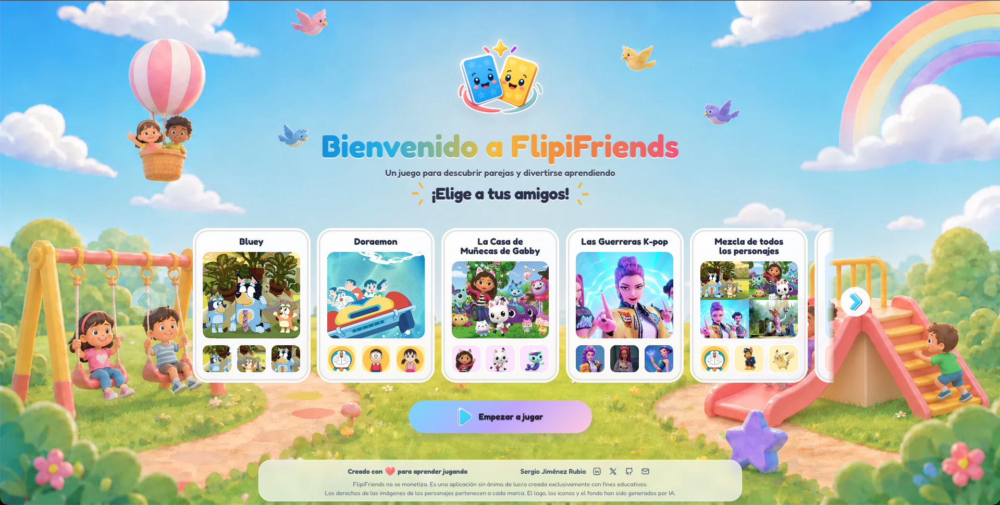
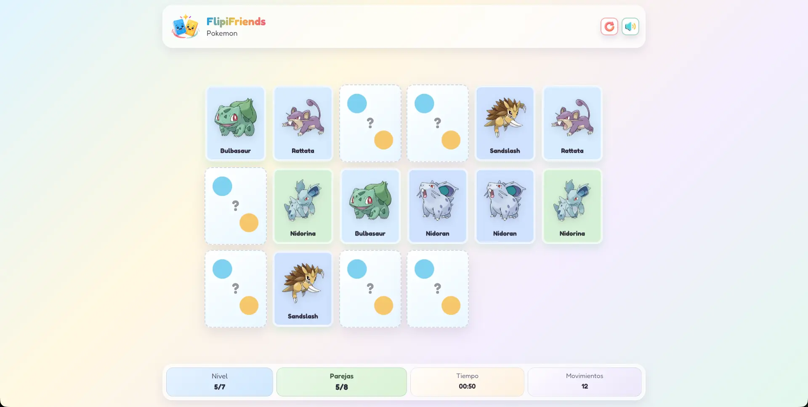

# FlipiFriends

FlipiFriends es un juego de memoria de parejas pensado para niños y familias. La app permite elegir entre varias colecciones de personajes, jugar niveles progresivos y seguir la partida con contador de parejas, tiempo y movimientos.





## Características

- Selección de familias de personajes: Bluey, Patrulla Canina, La Casa de Muñecas de Gabby, Pokemon, Las Guerreras K-pop, Doraemon, Zootropolis, Toy Story, Los Minions, Super Mario Bros y mezcla completa.
- Niveles progresivos de 2 a 12 parejas, ajustados según los personajes disponibles.
- Tablero responsive que recalcula columnas y tamaño de carta según el espacio disponible.
- Indicadores de nivel, parejas encontradas, tiempo y movimientos.
- Feedback visual al acertar o fallar una pareja.
- Sonido activable o desactivable durante la partida.
- Soporte PWA con manifest, iconos y service worker.
- Validación del catálogo de personajes antes de generar el build.

## Stack

- React 19
- Vite
- CSS modular por componente
- vite-plugin-pwa
- canvas-confetti
- ESLint

## Instalación

```bash
pnpm install
pnpm dev
```

La app se abrirá en modo desarrollo en la URL que indique Vite, normalmente `http://localhost:5173`.

## Scripts

```bash
pnpm dev
pnpm build
pnpm preview
pnpm lint
pnpm validate:catalog
```

- `pnpm dev`: levanta el entorno local de desarrollo.
- `pnpm build`: valida el catálogo de personajes y genera la versión de producción.
- `pnpm preview`: sirve localmente el build de producción.
- `pnpm lint`: ejecuta ESLint sobre el proyecto.
- `pnpm validate:catalog`: comprueba que los grupos y personajes tengan los campos requeridos.

## Estructura principal

```text
src/
  components/         Componentes de interfaz
  data/               Catálogo de personajes y grupos
  hooks/              Estado y lógica de juego
  utils/              Utilidades de niveles, cartas y tablero
  sw.js               Service worker de la PWA
public/
  brand/              Logotipos
  characters/         Imágenes de personajes
  screenshots/        Capturas para documentación
```

## Nota

Proyecto personal sin ánimo de lucro, creado con fines educativos y de portfolio.
